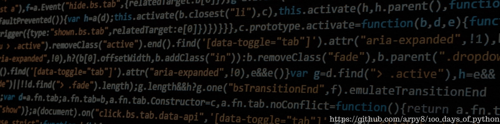

# 🚀 100 Days of Python Challenge

Welcome to my **100 Days of Python** challenge! 🐍 This is a personal project where I commit to coding in Python **every day for 100 days straight**, aiming to improve my programming skills and deepen my understanding of Python. 🎯

📚 **Course Link:** [100 Days of Code: The Complete Python Pro Bootcamp](https://www.udemy.com/course/100-days-of-code/)

## 📂 Project Structure

📁 **/Day-X**: Each day has its own directory, containing a Python script with my code for that day.
📄 **README.md**: The main documentation for the project. It includes:
  - An **overview** of the challenge 📝
  - A list of **topics covered** each day 📌
  - Additional **notes and thoughts** 💡

## 🎯 Goals
- Improve Python coding skills 🏆
- Learn and apply new concepts daily 🧠
- Build a **consistent** coding habit ⏳

Stay tuned for daily updates! 🚀

